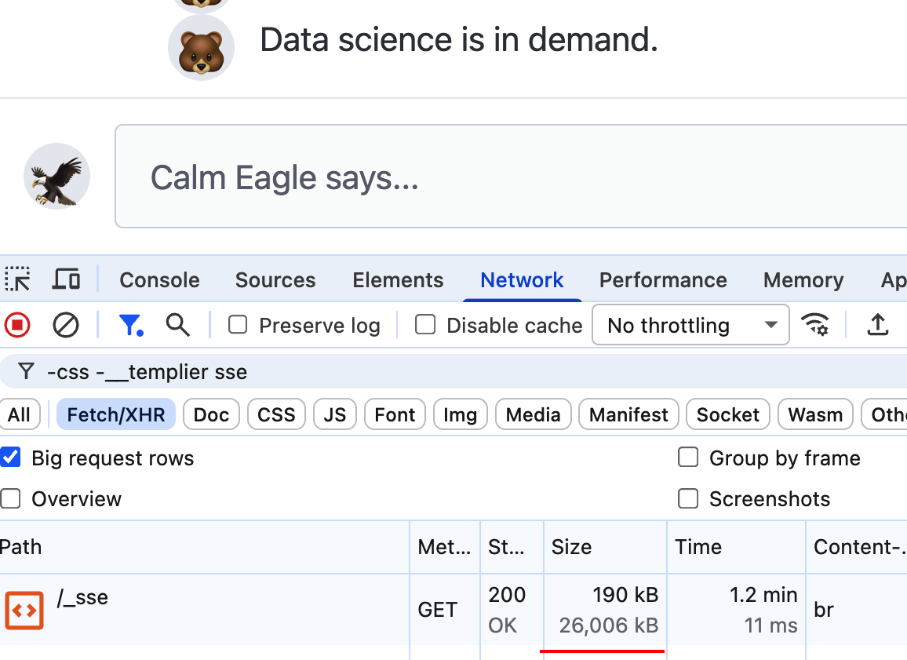

# The [Datastar](https://data-star.dev/) Way

The ideal (not dogmatic) way of using Datastar to build [real-time](https://example.andersmurphy.com/), [collaborative](https://checkboxes.andersmurphy.com/) web apps, as well as simple websites using this [mental model](https://yagni.club/3m475dwkjvc2o), without losing any [performance](https://andersmurphy.com/2025/04/07/clojure-realtime-collaborative-web-apps-without-clojurescript.html).

Additional Infos

-   Credit me ([Huangphoux](https://github.com/Huangphoux/)) if you use any part of this.
-   All linked sources are of my own picking. I don't get paid to write any of this.
-   If you're productive with React or htmx, keep using it.
    -   Architectural decisions in a team is [sociological](https://htmx.org/essays/when-to-use-hypermedia/#if-your-team-is-not-on-board).
    -   [Think twice](https://jsx.lol/) before deciding on React.
-   The shift in thinking from htmx to Datastar is as big as from React to htmx.
-   There are other hypermedia [libraries](https://htmx.org/essays/alternatives/), as well as a [comparision](https://nomini.js.org/comparison/) between some of them.

## [Hypermedia System](https://hypermedia.systems/) + [Fat Morphing](https://data-star.dev/how_tos/prevent_sse_connections_closing#cqrs-pattern) + [SSE](https://yagni.club/3m475dwkjvc2o) + [Brotli](https://andersmurphy.com/2025/04/15/why-you-should-use-brotli-sse.html)

1.  **Hypermedia System**

    -   Respond with HTML instead of [JSON](https://htmx.org/essays/hateoas/).
    -   Use [`data-on`](https://data-star.dev/reference/attributes#data-on) to generalize hypermedia controls: `data-on:click="@get('/endpoint')"`
        -   Any [element](https://developer.mozilla.org/en-US/docs/Web/HTML/Reference/Elements) can make HTTP requests: `data-on`
        -   Any [event](https://developer.mozilla.org/en-US/docs/Web/API/Document_Object_Model/Events) can trigger HTTP requests: `click`
        -   Use [Backend Actions](https://data-star.dev/guide/backend_requests#backend-actions) to send any type of requests: `@get('/endpoint')`

2.  **Fat Morphing**
    -   Respond with the entire modified page.
    -   The morphing [algorithm](https://github.com/bigskysoftware/idiomorph) will convert the old page into the new modified one.
3.  **SSE**: open an long-lived connection to stream reponses to the client.
4.  **Brotli**: compress the whole stream with tunable memory.

Without much adjustments (differentiating users by [session IDs](https://gist.github.com/axelknock/77d44d12bd84db6b4c8aabf7aad3d15a)), by doing this way, [multiplayer](notes.md#multiplayer) is the default behavior.

## data-on: the only [attribute](https://data-star.dev/reference/attributes) that you would need

-   There are other `data-on` attributes for non-standard events as well:
    -   [`data-init`](https://data-star.dev/reference/attributes#data-init): used to be [`data-on-load`](https://github.com/starfederation/datastar/releases/tag/v1.0.0-RC.6)
    -   [`data-on-intersect`](https://data-star.dev/reference/attributes#data-on-intersect)
    -   [`data-on-interval`](https://data-star.dev/reference/attributes#data-on-interval)
    -   [`data-on-signal-patch`](https://data-star.dev/reference/attributes#data-on-signal-patch)

Additional Infos

-   The string evaluated by `data-on` attributes are Datastar [expressions](https://data-star.dev/guide/datastar_expressions), you can do more than using only Backend Actions.
    -   `data-on:click="confirm('Are you sure?') && @delete('/examples/delete_row/0')"`
-   Be sure to use request indicators, as they are an important UX aspect of any distributed apps: `data-indicator:_fetching`, `data-attr:disabled="$_fetching"`
    -   `$_fetching` is a [signal](notes.md#signals)

## Fat Morphing

-   Suitable for collaborative app: all users see the same updated page
-   Behave similarly to htmx's [`hx-boost`](https://htmx.org/attributes/hx-boost/), but Datastar morphs and retains elements, instead of swapping the whole `<body>` like htmx.
-   Yes, you're doing MPA (Multi-Page Application). It's [hypermedia-driven](https://htmx.org/essays/hypermedia-driven-applications/). Did you read [the book](https://hypermedia.systems/)?

### Fat

-   Send the entire modified page instead of small, specific fragments.
-   Reduce the amount of endpoints needed to handle fragment updates.

Additional Infos

-   Be sure to use [Event Bubbling](https://javascript.info/bubbling-and-capturing)
-   Use `data-on:pointerdown/mousedown` rather than `data-on:click` to save the time waiting for `pointerup/mouseup`.

### Morphing

- Transform the existing DOM into the new modified one, while preserving the state.
- Here's an [article](https://dev.37signals.com/a-happier-happy-path-in-turbo-with-morphing/) written by Jorge Manrubia, demonstrating the difference between `<body>` swapping and morphing.

Additional Infos

-   It can also be called "[Patching](https://data-star.dev/guide/getting_started#patching-elements)": `Create`, `Update` and `Delete` elements
-   There are other algorithms as well: [Morphlex](https://github.com/yippee-fun/morphlex) (the introductory [article](https://joel.drapper.me/p/morphlex/)), and Datastar's TypeScript [port](https://github.com/starfederation/datastar/blob/develop/library/src/engine/morph.ts) of Idiomorph.
-   The algorithm [retains](https://en.wikipedia.org/wiki/Retained_mode) unchanged elements, but the way we respond with the whole page is [immediate](<https://en.wikipedia.org/wiki/Immediate_mode_(computer_graphics)>).

### How to do Fat Morphing optimally

This is one way of doing Fat Morphing, Datastar can do polling just fine.

Optimal Fat Morphing

### CQRS

-   To do Fat Morphing optimally, we should limit the number of endpoints that can change the view, since we don't need to send small fragments.
-   CQRS stands for Command Query Responsibility Segregation, meaning separating the Commands and the Queries of data apart.
-   Commands: `Create`, `Update` and `Delete`
    -   HTTP equivalence: `POST`, `PUT`, `PATCH`, `DELETE`
    -   These are all actions that change the data. These should not directly update the view.
        -   Queries already take care of that responsibility.
        -   Instead of patching elements, they can patch signals.
-   Queries: `Read`
    -   HTTP equivalence: `GET`
    -   This action can retrieve data and watch for data changes to compute the view
    -   Work Sharing, or Caching: make sure the query runs only once if multiple users are requesting the same view.

### Event-Driven Architecture

-   Queries watch for data changes by watching for new Command.
-   Whenever there's a new Command, the Queries retrieve the modified data.
-   Use the Publish-Subscribe pattern to implement Event-Driven Architecture

### [View = Function(State)](https://yagni.club/3m3anpetejc23)

-   By using CQRS, our app becomes the purest `view=function(state)`
-   A function turning state into view: present data using HTML, then compute it as a page ⇒ Data drives views
-   All data stored and processed on the back end
-   On every data change, the page gets re-computed
-   Each page only needs one single function to compute the page

## SSE

Suitable for real-time apps: updates can be sent in a stream that get compressed for its whole duration

-   Use HTTP/2 or HTTP/3 to allow for more [connections](https://github.com/alvarolm/datastar-resources/blob/main/docs/considerations.md#6-connection-sse-limit-on-http11)
-   `text/html` for the initial page load, then [`text/event-stream`](https://data-star.dev/essays/event_streams_all_the_way_down#the-solution) for subsequent responses

## Brotli

-   A lossless data compression algorithm.
-   Specifically created to compress HTTP stream.
-   Compressing a stream of data is better.
    -   There would be a lot of duplications in the stream.
    -   Compression reduces those duplications effectively by forward and backward referencing.
    -   Compression ratio is much larger over streams than when compressing a single HTML/JSON response.
-   Tunable context window
    -   The memory shared between the server and the client, stores the past and future data.
    -   You should increase it from the default 32 kB to reduce network and CPU usage on the client.
-   A [demonstration](https://discord.com/channels/1296224603642925098/1296225503610671224/1385153666306019401) of Brotli's effective compression by Anders Murphy. 

Stats and comparison for nerds

### Stats

-   Here are some anecdotal statistics, provided by members of the Datastar [Discord server](https://discord.gg/bnRNgZjgPh).
    -   [Screenshot](https://discord.com/channels/1296224603642925098/1296225449260879973/1438509367686201364) by winkler1. 
        -   Compressed 26 MB down to 190 kB, over 1.2 minutes.
        -   Compression reduced size by 137 times.
    -   [Testimony](https://discord.com/channels/1296224603642925098/1296225449260879973/1437107613413150780) provided by jeffmarco
        -   Compressed 6 MB down to 14 kB, over 30 seconds.
        -   Compression reduced size by 429 times.

### Comparison with gzip

-   Gzip can't look ahead effectively and can't look back at all.
-   Non-adjustable 32 kB context window.
-   Not built with streaming support in mind.
-   Worse than Brotli 4 to 6 times over a stream.
    -   Using gzip for streaming is still better than regular request-response.
-   A comparison between gzip and Brotli, done by Anders Murphy. 
    -   Over the same size SSE streams, out of the box, Brotli compresses 2 times better than gzip.
    -   With tunable memory, you can get 3 times (or more!) better compression.

# Notes

[Here](notes.md) are some notes regarding using Datastar that aren't important to be included in this document.
